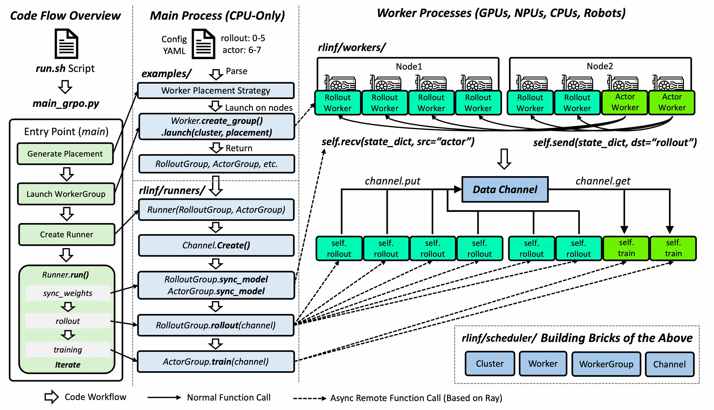
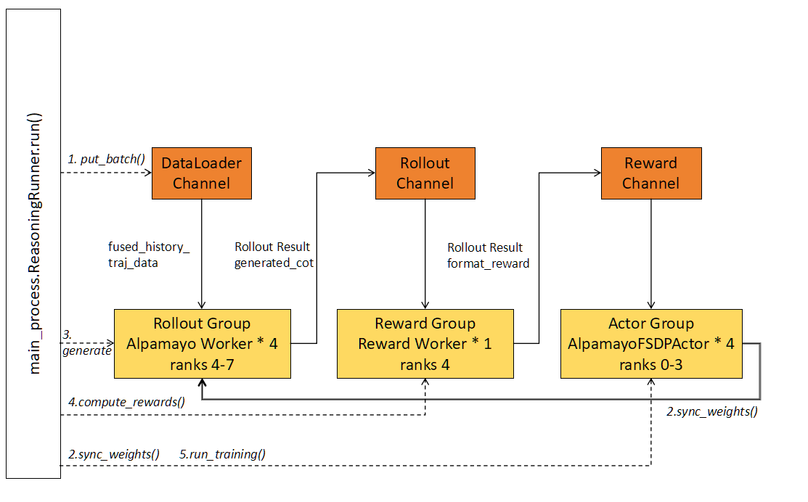

# 基于 RLinf 的 Alpamayo 适配
## RLinf Overview

## Alpamayo Demo
目前跑通以 Alpamayo VLM(Qwen3_VL base) 为训练主体的 demo，以完整 Alpamayo 为训练主体的 demo 在权重同步阶段会出现OOM，正在排查中。
### workflow

### preparation
- download dataset
```bash
python download_dataset.py
```
- save Alpamayo VLM(Qwen3_VL base) checkpoint
```bash
python prepare_alpamayo_qwen3_vl.py
```
### training
```bash
python examples/reasoning/main_grpo.py --config-path=config/driving --config-name=alpamayo-qwen3-vl-grpo-fsdp
alpamayo-r1-cot-grpo-fsdp.yaml
```